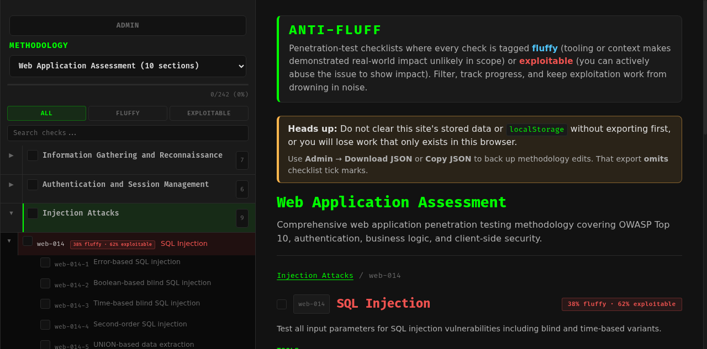
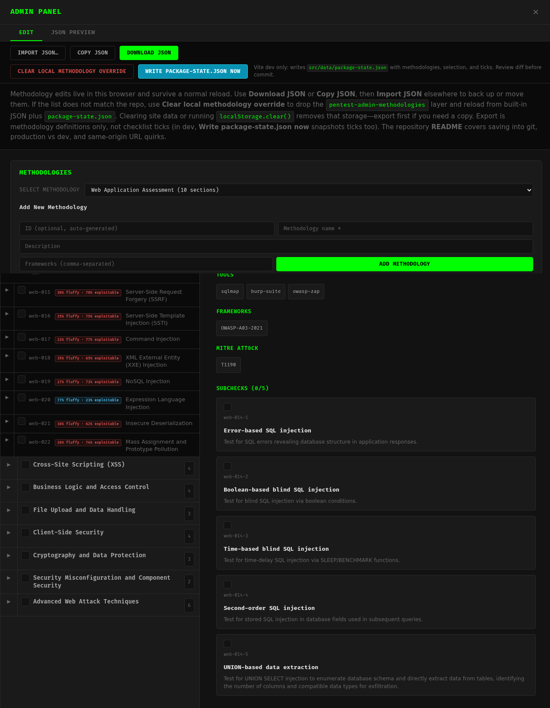

# PENTESTING_METHS

**Main view** (example: **Web Application Assessment** — *SQL Injection* check with **per-check fluffy vs exploitable %** in the header badge; sidebar lists the same mix per check):



**Admin panel** (methodology/section/check editor with **fluffy vs exploitable** slider and bar under *Add Check*; **Write package-state.json** only in `npm run dev`):



**ANTI-FLUFF** lives in **`pentest-checklist/`** — a React + TypeScript + Vite app for penetration-test methodology checklists (sections, checks, subchecks). Each check is tagged **fluffy** or **exploitable** so you can separate low-signal items from work where impact is easier to show.

## Fluffy vs exploitable (definitions)

- **`pentest-checklist/src/types/methodology.ts`** — `CHECK_TYPE_CONVENTION`, `CheckType`, and related docs.
- **`pentest-checklist/scripts/strict_check_types.py`** — optional classifier from wording (see script / `BORDERLINE_KEYS`).

Unless noted, shell commands are run from **`pentest-checklist/`** (where `package.json` is).

## Run locally

```bash
cd pentest-checklist
npm install    # once, or when dependencies change
npm run dev    # open the URL Vite prints (often http://localhost:5173)
```

**Ctrl+C** stops the server. You only need **`npm install`** again after dependency changes.

**Also:** `npm run build` → `dist/`, `npm run preview` (try the build locally), `npm run test`, `npm run lint`.

## Deploy (static `dist/`)

```bash
cd pentest-checklist
npm run build
```

Upload **`dist/`** to any static host (nginx, S3+CloudFront, Netlify, internal share, …). **No Node or Vite on the server** — only static files. `npm run preview` is optional smoke-test before upload.

**Persistence:** the **production** app never writes **`pentest-checklist/src/data/package-state.json`**. Methodology edits and ticks live in **each visitor’s `localStorage`** unless you use **Admin** export/import or ship a new build with updated JSON in git. **Admin → Download / Copy / Import JSON** works the same on a static host as in dev (no Vite on the server).

### Dev vs production (`localStorage`, `package-state.json`, export)

| | **`npm run dev`** | **Production** (`dist/` on a static host) |
|--|--|--|
| **Disk: `src/data/package-state.json`** | **Manual only:** Admin → **Write package-state.json now** (POST to Vite during `npm run dev`). No automatic disk writes. | **Never** — file is whatever was **bundled at build time**. |
| **After clearing site / `localStorage`** | Defaults = built-in **`*.json`** + **bundled** `package-state.json`, then empty methodology overlay until you edit again. | Same merge; **disk** never updates from the app. **Browser-only** methodology edits are **lost** unless you **exported** JSON first. |
| **Keeping methodology edits** | **Admin → Download / Copy JSON** → edit **`src/data/*.json`** → **`python3 scripts/strict_check_types.py`** → commit. Optional dev snapshot: **Write package-state.json**. | **Download / Copy** → clear storage → reload → **Import** (or redeploy a build with committed JSON). |
| **Checklist ticks** | In **`localStorage`**; included in **`package-state.json`** only when you **Write**. **Not** in Admin **Download JSON**. | Same. |

### Export (Copy / Download JSON) vs Write `package-state.json`

| | **Export** (Admin **Copy JSON** / **Download JSON**) | **Write package-state.json now** (dev only) |
|--|--|--|
| **Serialized** | **Methodologies only** (what **Import JSON** expects). | Full **`PackageStateFile`**: **`version`**, **`methodologies`**, **`selectedMethodologyId`**, **`checkedItems`**. |
| **Goes to** | Clipboard or a file path **you** choose. | Fixed repo path **`pentest-checklist/src/data/package-state.json`** via the Vite dev server. |
| **Typical use** | Portable backup, hand-edit **`src/data/*.json`**, import on another browser. | Snapshot **whole** in-app state into git (methodologies **and** ticks/selection) from **`npm run dev`**. |

**Dev:** After you **Write** (and the dev bundle picks up the file — JSON HMR or a reload), methodology definitions **stored in** `package-state.json` are **not lost** when you clear **`localStorage`** (including the methodology overlay key): on reload they load again from **built-ins + bundled `package-state.json`**. **Commit** the file if you want that snapshot on another clone or after a clean checkout.

**Production:** The static app **cannot** write `package-state.json`. Methodology edits live in the browser until you **Copy / Download JSON** (or redeploy a build that already embeds updated JSON). **Clear site data without an export and those edits are gone.**

### Admin: Clear local methodology override vs Write package-state.json

| Control | When you see it |
|--------|------------------|
| **Clear local methodology override** | **Admin** in **dev and production** — removes **`pentest-admin-methodologies`**, reloads methodologies from **built-ins + bundled `package-state.json`**, then saves that merge back to `localStorage` (clean overlay). Does **not** clear selected methodology or tick keys. |
| **Write package-state.json now** | **Admin** only when **`MODE === 'development'`** (usually **`npm run dev`**). Hidden in **`dist/`**; static hosts have no save endpoint. |

**Merge order** (later wins by methodology **`id`**; whole methodology replaced): (1) built-in **`src/data/*.json`**, (2) **`methodologies`** from bundled **`package-state.json`**, (3) **`localStorage`** `pentest-admin-methodologies`. Code: `loadAllMethodologies` in **`pentest-checklist/src/hooks/useMethodologies.ts`**.

**Write** POSTs current **`methodologies`**, **`selectedMethodologyId`**, and **`checkedItems`** from the browser — i.e. **what the UI has now**, not a fresh git-only recompute.

| Order | Effect |
|--------|--------|
| **Clear → Write** | Safest disk snapshot: methodologies = (1)+(2) only, plus current selection/ticks from their keys. |
| **Write → Clear** | Disk unchanged until you **Write** again; Clear only fixes in-browser methodology state. |
| **Write without Clear** | Disk reflects whatever methodologies were in memory (bad overlay possible if (3) was wrong). |

After **Write**, on-disk JSON updates immediately; the bundled `import` of `package-state.json` refreshes on **Vite JSON HMR** or a **full reload**.

## Saving and moving methodology edits

Data lives **in this browser for this origin** until you export it or change the repo.

**Move or back up:** **Admin** → **Download JSON** or **Copy JSON** → on another machine/browser, **Admin** → **Import JSON…**. Store the file anywhere you like.

**Export scope:** methodology definitions **only** — **not** checklist tick marks (those stay in `localStorage` unless baked into `package-state.json` via dev **Write**).

**What wipes it:** clearing site data, DevTools storage clear, or **`localStorage.clear()`** — use **Download JSON** first if you care.

**“It vanished” without clearing:** storage is **per exact URL** (e.g. `localhost` vs `127.0.0.1` are different sites). Use the same origin or import your backup.

## Developers: repo workflow

- **`python3 scripts/strict_check_types.py`** — align / validate types against **`src/data/*.json`** before you rely on committed JSON.
- **`package-state.json`** — commit only when you mean to ship that snapshot; **review `git diff`** after **Write**.
- **Portable methodology edits** — prefer **Admin export/import** and/or editing **`src/data/*.json`** over depending on browser-only state.

---

Stack: [Vite](https://vite.dev/) + [React](https://react.dev/).
